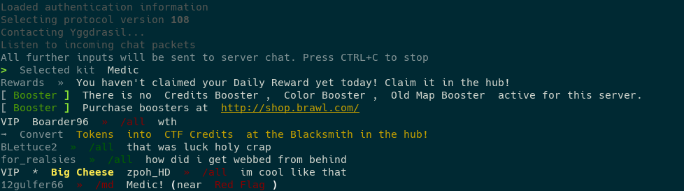

# MChat

A console chat client for most Minecraft server versions. This project is a combination of [@ammaraskar](https://github.com/ammaraskar)'s [PyCraft](https://github.com/ammaraskar/pyCraft) client library, and [@willmcgugan](https://github.com/willmcgugan)'s [rich text library](https://github.com/willmcgugan/rich) for Python.

## Installation

### From PIP

```sh
# Install PyCraft
python3 -m pip install https://github.com/ammaraskar/pyCraft.git

# Install MChat
python3 -m pip install mchat
```

### From Source

To install from source using the [Poetry](https://python-poetry.org/) build tool and [pyenv](https://github.com/pyenv/pyenv), clone this repository, then run:

```sh
pyenv install 3.9.0
pyenv local 3.9.0
poetry install
```

## Usage

MChat can be run as `mchat` if installed from PIP or as `poetry run python3 -m mchat` if running from the GIT repo.

Usage is as follows:

```text
usage: mchat [-h] [-p PORT] [-u USERNAME] [-v VERSION] server_address

A console chat client for most Minecraft server versions

positional arguments:
  server_address        IP address of a Minecraft server

optional arguments:
  -h, --help            show this help message and exit
  -p PORT, --port PORT  Minecraft server port (default: 25565)
  -u USERNAME, --username USERNAME
                        Minecraft username or email
  -v VERSION, --version VERSION
                        Client -> Server protocol version to use (default: 1.16.4)
```

You will be prompted for a username (if not passed as an argument), and password when running the program.

## Screenshots



*Demo on mcctf.com*
